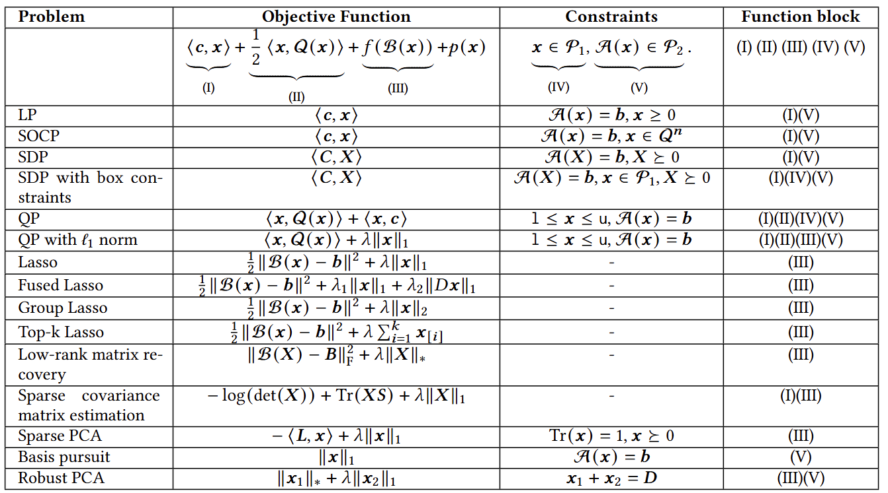
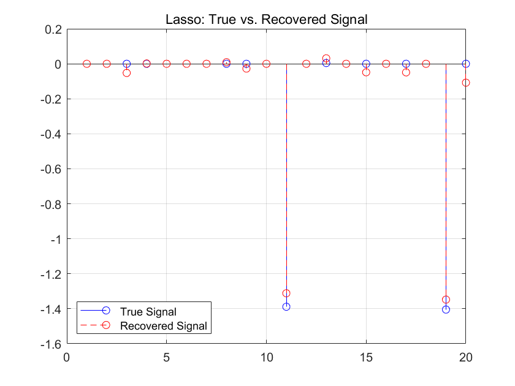
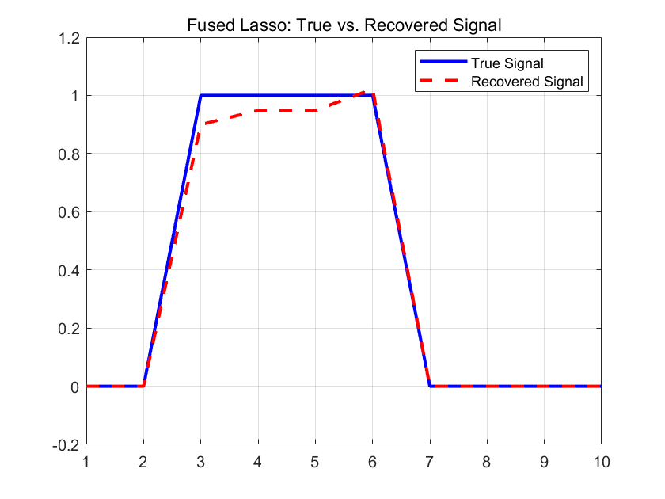
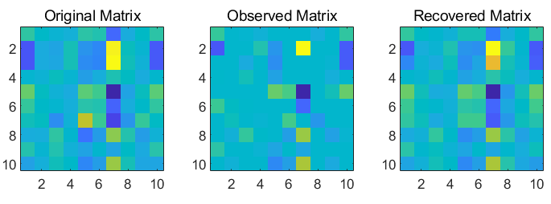

## SSNCVX

- SSNCVX (**S**emi-**S**mooth **N**ewton method for **C**on**v**e**x** optimization) is both the name of **our software package** and the **underlying algorithmic framework**.
- It is designed to efficiently solve **convex composite optimization problems**, including those with nonsmooth terms and conic constraints, as well as multi-block structures.
- The **MATLAB** version is open source in this repo and specific details can be found in [this paper](#).
- The ​​**C**++​​ version, is specifically designed to handle conic programming problems and offers improved performance for large-scale instances.
- Visit [our website](http://faculty.bicmr.pku.edu.cn/~wenzw/ssncvx/index.html) for more detailed information.

## Problem Formulation

SSNCVX is a general algorithmic framework for solving the following convex composite optimization problem:

$$
\begin{aligned}
\min_{\mathbf{x}} \quad & p(\mathbf{x}) + f(\mathcal{B}(\mathbf{x})) + \langle \mathbf{c}, \mathbf{x} \rangle + \frac{1}{2} \langle \mathbf{x}, \mathcal{Q}(\mathbf{x}) \rangle, \\
\text{s.t.} \quad & \mathbf{x} \in \mathcal{P}_1, ~~ \mathcal{A}(\mathbf{x}) \in \mathcal{P}_2,
\end{aligned}
$$

where $p(\mathbf{x})$ is a convex and nonsmooth function,  $\mathcal{A}: \mathcal{X} \rightarrow \mathbb{R}^m$, $\mathcal{B}: \mathcal{X} \rightarrow \mathbb{R}^l$ are linear operators, $f: \mathbb{R}^l \rightarrow \mathbb{R}$ is a convex function, $\mathbf{c} \in \mathcal{X}$, $\mathcal{Q}$ is a positive semidefinite matrix or operator, $\mathcal{P}_1 = \\{\mathbf{x} \in \mathcal{X} \mid \texttt{l} \le \mathbf{x} \le \texttt{u}\\}$ and $\mathcal{P}_2 = \\{\mathbf{x}\in \mathbb{R}^m \mid \texttt{lb} \le \mathbf{x} \le \texttt{ub}\\}$. 


Here we list some examples of the problem.


## Installation

1.  **Prerequisites:**
    MATLAB R2020a or a later version. (For old versions of MATLAB, there are some issues with mex functions.)

2.  **Download the package:**
    Clone this repository from GitHub.

3.  **Compile mex functions:**
    We have compiled mex functions for SSNCVX, but if there are any issues with the compiled mex functions, you can compile them yourself.
    
    Navigate to the `src\mexfun` directory within the package, delete files with suffix `.mexw64`, `.mexa64`, `.mexmaci64`, `.mexmaca64`. Then open `Installmex_ssm.m` in MATLAB and run it.

4.  **Verify the installation:**
    To verify that the installation is successful, you can run a simple example provided. Navigate to the `example` directory within the package and run the example script.

    If the script runs without any errors, the solver has been installed correctly.

5.  **Add datasets and set path:**
    If you want to use scripts in `example` directory to solve problems mentioned in the paper, please modify `example\addpath_data.m` and add the path of the datasets to the `data_dir` variable.


## Examples


### Lasso

Lasso (Least Absolute Shrinkage and Selection Operator) is a regression analysis method that performs both variable selection and regularization in order to enhance the prediction accuracy and interpretability of the statistical model it produces.

--------------
**The Problem**

The Lasso optimization problem is:

```
minimize (1/2) * ||Ax - b||₂² + λ * ||x||₁
```

Where:
- `A` is the design matrix.
- `b` is the response vector.
- `x` is the vector of coefficients to be determined.
- `λ` (lambda) is the regularization parameter, which controls the sparsity of the solution.

In this tutorial, we will solve a small Lasso problem with randomly generated data.

--------------
**MATLAB Implementation**

Here is the complete MATLAB script to solve this problem. You can copy and paste this into a new `.m` file and run it.

```matlab
%% Tutorial for Lasso Problem
% This script demonstrates how to solve a Lasso problem using SSNCVX.
% The problem is defined as:
%
% min 0.5*||Ax-b||_2^2 + lambda*||x||_1
%
% We will construct a small-scale problem to illustrate the usage.

clear;clc;
addpath(genpath('../'));

%% Problem Data Construction
% Generate a small random problem.
m = 10; % Number of measurements
n = 20; % Number of features

rng(42);
A = randn(m, n);
x_true = sprandn(n, 1, 0.2); % A sparse signal with 20% non-zero elements
b = A * x_true + 0.1 * randn(m, 1);

lambda = 0.1;

%% pblk setting for the l1-norm penalty
% p(x) = lambda*||x||_1
pblk{1} = struct;
pblk{1}.type = 'l1';
pblk{1}.size = n;
pblk{1}.coefficient = lambda;

%% f setting for the least-squares data fitting term
% f(y) = 0.5*||y-b||^2 where y = Ax
f{1} = struct;
f{1}.type = 'square';
f{1}.size = m; % The dimension of y is m
f{1}.coefficient = 0.5;
f{1}.shift = b;

%% Initial guess and solver options
x0 = zeros(n, 1);
Bt = A'; % The solver requires the transpose of A

opts = struct(); % Use default options

%% Call the solver
fprintf('Solving a small Lasso problem...\n');
[xopt, out] = SSNCVX(x0, pblk, Bt, f, [], [], [], [], [], [], [], opts);

%% Display results
fprintf('Solver finished.\n');
fprintf('Total time: %f seconds\n', out.totaltime);

% Plot results for comparison
figure;
stem(x_true, 'b-');
hold on;
stem(xopt.var{1}, 'r--');
legend('True Signal', 'Recovered Signal');
title('Lasso: True vs. Recovered Signal');
grid on;
```


### Fused Lasso

The Fused Lasso is an extension of the Lasso that is particularly useful for problems where features have a natural ordering (e.g., time series or genomic data). It encourages sparsity in both the coefficients and their successive differences, leading to piecewise constant solutions.

--------------
**The Problem**

The Fused Lasso optimization problem is:

```
minimize (1/2) * ||Ax - b||₂² + λ₁ * ||x||₁ + λ₂ * ||Dx||₁
```

Where:
- `A` is the design matrix, `b` is the response vector, and `x` is the coefficient vector.
- `λ₁` is the regularization parameter for the L1 norm of `x`, encouraging sparsity.
- `λ₂` is the regularization parameter for the L1 norm of the differences `Dx`.
- `D` is a matrix that computes the differences between adjacent elements of `x`.

--------------
**MATLAB Implementation**

This example demonstrates how to solve a Fused Lasso problem. We'll generate a piecewise constant signal and try to recover it.

```matlab
%% Tutorial for Fused Lasso Problem
% This script demonstrates how to solve a Fused Lasso problem using SSNCVX.
% The problem is defined as:
%
% min 0.5*||Ax-b||_2^2 + lambda1*||x||_1 + lambda2*sum(|x_i - x_{i-1}|)
%
% We will construct a small-scale problem to illustrate the usage.

clear;clc;
addpath(genpath('../'));

%% Problem Data Construction
% Generate a small random problem.
m = 5;  % Number of measurements
n = 10; % Number of features

rng(42);
A = randn(m, n);
b = randn(m, 1);
x_true = zeros(n, 1);
x_true(3:6) = 1; % A sparse and piecewise-constant signal
b = A * x_true + 0.1 * randn(m, 1);

lambda1 = 0.1;
lambda2 = 0.1;

%% pblk setting for the Fused Lasso penalty
% p(x) = lambda1*||x||_1 + lambda2*sum(|x_i - x_{i-1}|)
pblk{1} = struct;
pblk{1}.type = 'fused';
pblk{1}.size = n;
pblk{1}.coefficient = lambda1;
pblk{1}.coefficient2 = lambda2;
[Bmap,BTmap] = FLBmap(n);
pblk{1}.Binput = struct();
pblk{1}.Binput.Bmap = Bmap;
pblk{1}.Binput.BTmap = BTmap;

%% f setting for the least-squares data fitting term
% f(y) = 0.5*||y-b||^2 where y = Ax
f{1} = struct;
f{1}.type = 'square';
f{1}.size = m; % The dimension of y is m
f{1}.coefficient = 0.5;
f{1}.shift = b;

%% Initial guess and solver options
x0 = zeros(n, 1);
Bt = A'; % The solver requires the transpose of A

opts = struct();
opts.method = 'direct'; % Use direct method rather than iterative

%% Call the solver
fprintf('Solving a small Fused Lasso problem...\n');
[xopt, out] = SSNCVX(x0, pblk, Bt, f, [], [], [], [], [], [], [], opts);

%% Display results
fprintf('Solver finished.\n');
fprintf('Total time: %f seconds\n', out.totaltime);

% Plot results for comparison
figure;
plot(x_true, 'b-', 'LineWidth', 2);
hold on;
plot(xopt.var{1}, 'r--', 'LineWidth', 2);
legend('True Signal', 'Recovered Signal');
title('Fused Lasso: True vs. Recovered Signal');
grid on;
```


### QP

Quadratic Programming (QP) is a fundamental problem in mathematical optimization. It involves minimizing a quadratic objective function over a feasible region defined by linear equality and inequality constraints. QP has a wide range of applications, including portfolio optimization, support vector machines, and control theory.

--------------
**The Problem**

The standard form of a Quadratic Program that SSNCVX can solve is:

```
minimize    (1/2) * x' * Q * x + c' * x
subject to  A * x = b
            l <= x <= u
```

Let's solve a random QP problem

--------------
**MATLAB Implementation**

Here is the complete MATLAB script to define and solve this problem using the SSNCVX solver.

```matlab
%% Tutorial for Quadratic Programming (QP)
% This script demonstrates how to solve a Quadratic Program using SSNCVX.
% The problem is defined as:
%
% min 0.5*x'*Q*x + c'*x
% s.t. Ax = b
%      lb <= x <= ub
%
% We will construct a small-scale problem to illustrate the usage.

clear;clc;
addpath(genpath('../'));

%% Problem Data Construction
n = 10; % Number of variables
m = 5;  % Number of equality constraints

% Generate a positive semi-definite matrix Q
rng(42);
Q_half = randn(n, n);
Q = Q_half' * Q_half; 
c = randn(n, 1);

A = randn(m, n);
x_true = rand(n, 1);
b = A * x_true;

lb_val = 0;
ub_val = Inf;

%% pblk setting for box constraints
% p(x) for lb <= x <= ub
pblk{1} = struct;
pblk{1}.type = 'box';
pblk{1}.size = n;
pblk{1}.l = lb_val * ones(n, 1);
pblk{1}.u = ub_val * ones(n, 1);

%% Q and C setting for the quadratic objective
% The objective is 0.5*x'*Q*x + c'*x
Q_in = Q;
C_in = {c};

%% At, lb, ub setting for equality constraints
% Ax = b
At_in = {A'};
lb_eq = b;
ub_eq = b;

%% Initial solver options
opts = struct(); % Use default options
opts.m = m;

%% Call the solver
fprintf('Solving a small QP problem...\n');
[xopt, out] = SSNCVX([], pblk, [], [], Q_in, C_in, [], [], At_in, lb_eq, ub_eq, opts);

%% Display results
fprintf('Solver finished.\n');
fprintf('Total time: %f seconds\n', out.totaltime);
fprintf('Constraint violation ||Ax-b||: %e\n', norm(A*xopt.var{1} - b));

% The optimal solution is in xopt.var{1}
fprintf('Optimal x (first 5 elements): \n');
disp(xopt.var{1}(1:5));
```

### SOCP

Second-Order Cone Programming (SOCP) is a class of convex optimization problems that includes Linear Programming (LP) as special cases. SOCP problems involve minimizing a linear function over an intersection of affine sets and second-order cones.

--------------
**The Problem**

The standard form of an SOCP is:

```
minimize    f' * x
subject to  ||A_i * x - b_i||_2 <= c_i' * x + d_i,  for i = 1,...,m
            F * x = g
```

Where `x` is the optimization variable. The constraints `||A_i * x - b_i||_2 <= c_i' * x + d_i` are called second-order cone constraints.

The SSNCVX solver handles problems in a standard conic form:

```
minimize    <C, x>
subject to  A * x = b
            x in K
```

Where `K` is a product of simple cones (e.g., non-negative, second-order).

Let's solve a simple SOCP:
```
minimize    x1 + x2 + 2*x3
subject to  x1 + 2*x2 + 3*x3 = 1
            ||[x2; x3]|| <= x1
```

--------------
**MATLAB Implementation**

Here is the MATLAB script to define and solve this problem.

```matlab
%% Tutorial for Second-Order Cone Programming (SOCP)
% This script demonstrates how to solve an SOCP problem using SSNCVX.
% The problem is defined as:
%
% min c'*x
% s.t. A*x = b
%      x in K
%
% where K is a product of second-order cones.
% K = K_1 x K_2 x ... x K_L
% K_j = {x_j = (t_j; v_j) | ||v_j||_2 <= t_j}
%
% We will solve a simple SOCP problem:
% min x1 + x2 + 2*x3
% s.t. x1 + 2*x2 + 3*x3 = 1
%      ||[x2; x3]|| <= x1

clear;clc;
addpath(genpath('../'));

%% Problem Data Construction
% min x1 + x2 + 2*x3  => c = [1; 1; 2]
C = {[1; 1; 2]};
n = 3;

% s.t. x1 + 2*x2 + 3*x3 = 1 => A = [1 2 3], b = 1
At = {[1; 2; 3]};
lb = 1;
ub = 1;
m = 1;

% s.t. ||[x2; x3]|| <= x1
% This defines a second-order cone constraint on x = [x1; x2; x3].
% The cone is of size 3.
pblk{1} = struct;
pblk{1}.type = 'q'; % 'q' for quadratic or second-order cone
pblk{1}.size = 3;
pblk{1}.coefficient = 1; % Not used in this context, but required

% The K structure is also needed by the solver options
K{1} = struct;
K{1}.type = 'q';
K{1}.size = 3;

%% Initial guess and solver options
opts = struct();
opts.method = 'direct';
opts.K = K;
opts.m = m;

%% Call the solver
fprintf('Solving a small SOCP problem...\n');
% For SOCP, the structure of the call is similar to QP.
% We pass empty placeholders for unused arguments.
[xopt, out] = SSNCVX([], pblk, [], [], [], C, [], [], At, lb, ub, opts);

%% Display results
fprintf('Solver finished.\n');
fprintf('Total time: %f seconds\n', out.totaltime);

% The optimal solution is in xopt.var{1}
sol = xopt.var{1};
fprintf('Optimal solution x = [%f, %f, %f]\n', sol(1), sol(2), sol(3));

% Verify constraints
fprintf('Constraint violation ||Ax-b||: %e\n', norm(At{1}'*sol - lb));
fprintf('SOCP constraint: x1 = %f, ||[x2;x3]|| = %f\n', sol(1), norm(sol(2:3)));
if sol(1) >= norm(sol(2:3)) - 1e-6
    fprintf('SOCP constraint is satisfied.\n');
else
    fprintf('SOCP constraint is VIOLATED.\n');
end
```

### LRMC

Low-Rank Matrix Completion (LRMC) is the task of recovering a matrix from a small subset of its entries, under the assumption that the original matrix is low-rank. This has applications in recommendation systems (predicting user ratings), image inpainting, and system identification.

--------------
**The Problem**

The most common formulation for LRMC is the nuclear norm minimization problem:

```
minimize ||X||_*
subject to P_Ω(X) = P_Ω(M)
```

Where:
- `X` is the matrix to be recovered.
- `||X||_*` is the nuclear norm of `X` (the sum of its singular values), which is a convex proxy for the rank of `X`.
- `M` is the original (unknown) low-rank matrix.
- `Ω` is the set of indices of the observed entries.
- `P_Ω` is a projection operator that keeps the entries in `Ω` and sets others to zero.

We can rewrite this as a least-squares problem with nuclear norm regularization:

```
minimize (1/2) * ||P_Ω(X) - P_Ω(M)||_F² + λ * ||X||_*
```

--------------
**MATLAB Implementation**

In this tutorial, we will generate a low-rank matrix, sample a fraction of its entries, and then use the SSNCVX solver to recover the full matrix.

```matlab
%% Tutorial for Low-Rank Matrix Completion (LRMC)
% This script demonstrates how to solve a matrix completion problem using SSNCVX.
% The problem is defined as:
%
% min ||X||_*
% s.t. P_Omega(X) = P_Omega(M)
%
% where ||.||_* is the nuclear norm (sum of singular values),
% M is the original matrix, and Omega is the set of observed entries.
% The solver addresses the formulation:
% min 0.5 * || P_Omega(X) - P_Omega(M) ||_F^2 + lambda * ||X||_*

clear;clc;
addpath(genpath('../'));

%% Problem Data Construction
% Create a low-rank matrix
n1 = 10;
n2 = 10;
rank = 2;
rng(42);
M = randn(n1, rank) * randn(rank, n2);

% Create a mask for observed entries (50% observed)
p = 0.5;
Omega = rand(n1, n2) < p;
M_observed = M .* Omega;

lambda = 0.1; % Regularization parameter

%% pblk setting for the nuclear norm penalty
% p(X) = lambda * ||X||_*
pblk{1} = struct;
pblk{1}.type = 'nuclear';
pblk{1}.size = [n1, n2];
pblk{1}.coefficient = lambda;

%% Bmap and BTmap for the sampling operator
B.Bmap = @(X) X .* Omega;
B.BTmap = @(Y) Y .* Omega;
B.out_size = [n1, n2];

%% f setting for the data fitting term
% f(y) = 0.5 * ||y - M_observed||_F^2 where y = Bmap(X)
f{1} = struct;
f{1}.type = 'square';
f{1}.size = [n1, n2];
f{1}.coefficient = 0.5;
f{1}.shift = M_observed;

%% Initial guess and solver options
x0 = zeros(n1, n2);
opts = struct(); % Use default options

%% Call the solver
fprintf('Solving a small Matrix Completion problem...\n');
[xopt, out] = SSNCVX(x0, pblk, B, f, [], [], [], [], [], [], [], opts);

%% Display results
fprintf('Solver finished.\n');
fprintf('Total time: %f seconds\n', out.totaltime);
fprintf('Relative recovery error: %f\n', norm(xopt.var{1} - M, 'fro') / norm(M, 'fro'));

% Visualize the results
figure;
subplot(1, 3, 1);
imagesc(M);
title('Original Matrix');
axis square;

subplot(1, 3, 2);
imagesc(M_observed);
title('Observed Matrix');
axis square;

subplot(1, 3, 3);
imagesc(xopt.var{1});
title('Recovered Matrix');
axis square;
```

## User defined $f$ or $p$
SSNCVX allows users to define their own functions for `f` (the smooth part) or `pblk` (the nonsmooth part) if the built-in types do not cover their specific needs. This flexibility enables the solver to handle a wider range of optimization problems. Specifically, users need to define the following components:
1. **Primal and dual objection function**: The user needs to define the primal and dual objective functions corresponding to their custom `f` or `pblk`. This involves specifying how to compute the function values given the input variables.
   
2. **Proximal Operator for pblk**: If you define a custom nonsmooth function `p(x)`, you need to provide its proximal operator. The proximal operator is defined as:

   $$
   \text{prox}_{\lambda p}(v) = \arg\min_x \left( p(x) + \frac{1}{2\lambda} \|x - v\|^2 \right)
   $$

   You should implement this as a MATLAB function that takes in the vector `v` and the parameter `lambda`, and returns the result of the proximal operation.
3. **Gradient and Hessian for $f^*$(if differentable) or the generalized jacboian $D\tilde{D}^{-1}D + \sigma D$ (if nonsmooth) of $f$**: For a custom smooth function `f(y)`, you need to provide its gradient and, if possible, its Hessian (or an approximation). 

4. **$D\tilde{D}^{-1}$ and $\tilde{D}^{-1}$ for $p$ or $f^*$ (if nonsmooth)**: If `f` is nonsmooth, you need to provide the generalized Jacobian `D` and its inverse $\tilde{D}^{-1}$. This is crucial for the semi-smooth Newton method used in SSNCVX.

Since the implementation of custom functions can be complex and highly dependent on the specific problem, there may be some bug or issues. If you encounter any problems or have questions, please feel free to contact one of the authors listed below.
## References
Our work on the semi-smooth Newton Methods:
- 	Liu Yiyang, Liu Haoyang, Nie Hantao, Wen Zaiwen, A DRS-Based Path-Following Algorithm for Linear Programming, Journal of Computational Mathematics, 2025
- 	Nie Hantao, Ma Jirui, Wen Zaiwen, Zhang Fan, An Operator Splitting-Based Interior-Point Method for Conic Linear Programming, Journal of the Operations Research Society of China, 2025
- 	Hu Jiang, Tian Tonghua, Pan Shaohua, Wen Zaiwen, On the local convergence of the Semismooth Newton Method for composite optimization, Journal of Scientific Computing, 2025, arXiv:2211.01127
- 	Deng Zhanwang, Deng Kangkang, Hu Jiang, Wen Zaiwen, An Augmented Lagrangian Primal-Dual Semismooth Newton method for multi-block composite optimization, Journal of Scientific Computing, 2025
- 	Zhou Yuxin, Jiayuan Wu, Wang Rui, Song Jie, Wen Zaiwen, A Semismooth Newton Augmented Lagrangian Method for Solving Nonlinear Programming, SCIENTIA SINICA Mathematica, 2025
- 	Wang Yifei, Deng Kangkang, Liu Haoyang, Wen Zaiwen, A Decomposition Augmented Lagrangian Method for Low-rank Semidefinite Programming, SIAM Journal on Optimization, Vol. 33, No. 3, 1361-1390, 2023
- 	Liu Yiyang, Wen Zaiwen, Wotao Yin, A multiscale semi-smooth Newton method for Optimal Transport, Journal of Scientific Computing, Vol. 91, No. 2, 39, 2022
- 	Andre Milzarek, Xiao Xiantao, Wen Zaiwen, Michael Ulbrich; On the local convergence of a stochastic semismooth Newton method for nonsmooth nonconvex optimization, Science in China Series A: Mathematics, Vol. 65, 2151–2170,2022
- 	Andre Milzarek, Xiao Xiantao, Cen Sicong, Wen Zaiwen, Michael Ulbrich; A stochastic semi-smooth Newton method for nonsmooth nonconvex optimization, SIAM Journal on Optimization, Vol 29, No. 4, pp. 2916–2948, 2019
- 	Li Yongfeng, Wen Zaiwen, Yang Chao, Yuan Yaxiang; A Semi-smooth Newton Method For semidefinite programs and its applications in electronic structure calculations; SIAM Journal on Scientific Computing; Vol 40, No. 6, 2018, A4131–A4157
- 	Xiao Xiantao, Li Yongfeng, Wen Zaiwen, Zhang Liwei; A Regularized Semi-Smooth Newton Method with Projection Steps for Composite Convex Programs; Journal of Scientific Computing; 2018, Vol 76, No. 1, pp 364-389
- 	Deng Zhanwang, Hu Jiang, Deng Kangkang, Wen Zaiwen, A Primal Dual Semismooth Newton Method for Semidefinite Programming, arXiv:2504.14333  
- 	Deng Zhanwang, Wei Tao, Ma Jirui, Wen Zaiwen, Deng Zhanwang, Hu Jiang, Deng Kangkang, Wen Zaiwen, A Primal Dual Semismooth Newton Method for Semidefinite Programming, 2025


If SSNCVX is useful in your research, please cite [our paper](#):

```bibtex
@misc{deng2025ssncvx,
  title={SSNCVX: A primal-dual semismooth Newton method for convex composite optimization},
  author={Zhanwang Deng and Tao Wei and Jirui Ma and Zaiwen Wen},
  year={2025},
}
```

We hope that the package is useful for your application. If you have any bug reports or comments, please feel free to email one of the toolbox authors:

 * Zhanwang Deng, dzw_opt2022 at stu.pku.edu.cn
 * Tao Wei, weit at pku.edu.cn
 * Jirui Ma, majirui at pku.edu.cn
 * Zaiwen Wen, wenzw at pku.edu.cn

# License
This package is released under the [MIT License](https://opensource.org/licenses/MIT).
